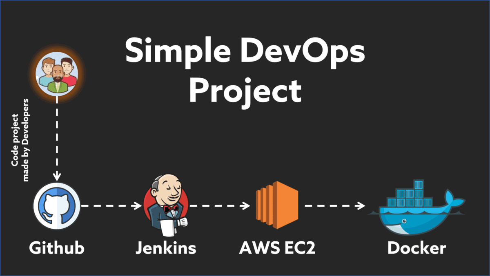

# Simple DevOps Project

This is a sample Web Application to use during Continuous Integration demos.
**Repository** github origin is taken from user [*sebsto*](https://github.com/sebsto/webapp).  

## Prerequisites
- Jenkins setup on a cloud.
- Github account making the Repository public. Webhooks setup with connection to Jenkins.
- EC2 instance on AWS server running on which all necessary compilers are installed such as Java.
- Docker running on EC2 instance.

## Flow Diagram

This Figure shows the flow of the project.


## Build Instruction:

```
mvn3 clean package
```

## Deploy instruction:

Deploy the generated `target/WebApp.war` file on Tomcat.
 
## TODO:

- Add more detailed information throughout the README.
- Include instructions for deploying to ElasticBeanstalk.

